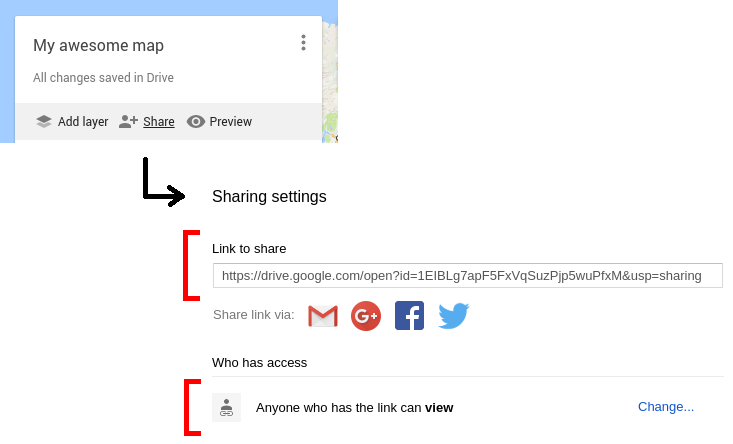
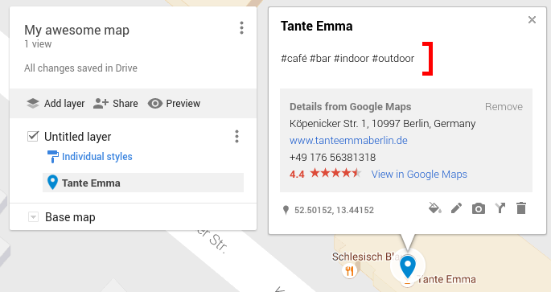

# Contributing

## 1. Create a map on [Google My Maps](https://google.com/mymaps)...

... and share it with the world:

## 2. Send me the link...

... by [creating an issue](https://github.com/AurelienLourot/mybeir.ut/issues).

Once I've linked your map to [mybeir.ut](https://beirut.myberl.in/), any place you'll add in your map will
immediately show up there.

## 3. Add some places...

... and tag them.

Each place must have at least one tag from each list (otherwise it won't show up in the app):

<!---
FIXME: generate this list
-->
* `#bar`, `#alcohol`, `#café`, `#workplace`, `#internet`, `#club`, `#cinema`, `#restaurant`,
  `#sightseeing`, `#beach`, `#pool`.
* `#indoor`, `#outdoor`.

Some more advices:

* Unknown tags will be ignored.
* Sort your tags: a bar being sometimes a club (`#bar #club`) isn't the same as a club being
  sometimes a bar (`#club #bar`).
* Shorten the place's name if possible, e.g. if Google suggests to name it `Café Tante Emma`, name
  it `Tante Emma` instead.
